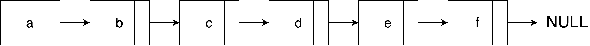
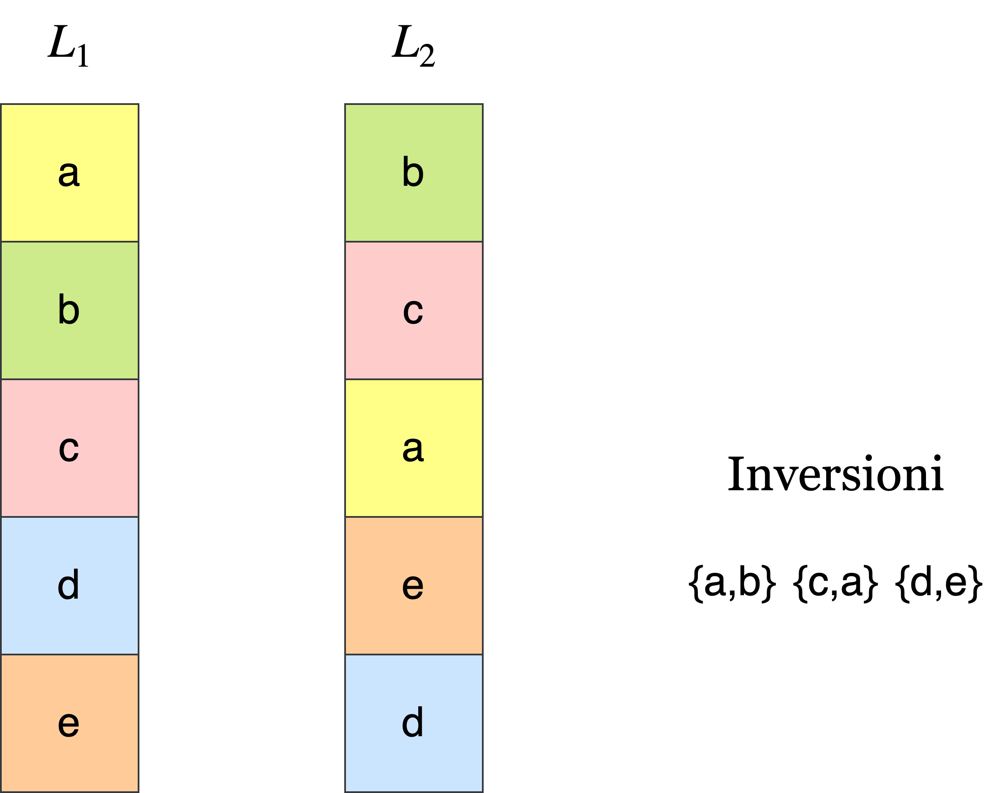

# 6 Move-to-Front
## 6.1 Introduzione
Data una lista di $n$ elementi

  
   
  <em>Figura 6.1: Descrizione della lista</em>

si vuole che l'ultimo elemento cercato diventi la nuova **testa** della lista per via del fatto che nel tempo successivo alla ricerca possa essere nuovamente riutilizzato.

## 6.2 Analisi del costo
Si supponga che l'ultimo elemento cercato sia l'elemento _f_ e che questo elemento, all'interno della lista, si trovi esattamente alla posizione $k$ allora si avrà un costo $k$ per ricercare l'elemento _f_ all'interno della lista dovuto allo scorrimento della stessa, elemento dopo elemento.

L'euristica **Move-to-Front** prevede una serie di scambi tra i nodi addiacenti, fino a quando l'elemento _f_ venga posizionato alla testa della lista.
Quindi saranno necessari $k-1$ scambi totali per portare _f_ fino alla testa della lista, il costo delle operazioni di scambi dopo la ricerca sarà quindi di $k-1$.

  
   
  <em>Figura 6.2: Processo che porta l'elemento f in testa.</em>

## 6.3 Analisi competitiva
Verrà utilizzata l'analisi ammortizzata (metodo del potenziale), per dimostrare che l'euristica _Move-to-Front_ ha una complessità al più 4 volte più grande rispetto a qualunque altro algoritmo anche ottimale.

### 6.3.1 Teorema
Sia $A = \{a_1,a_2,a_3,…,a_n\}$ l'insieme degli accessi ad una generica lista $L$ e siano $C_i^{MF}$ e $C_i^{AL}$ due configurazioni $i-esime$ della stessa lista $L$ di partenza dopo aver effettuato $a_i$ accessi, la prima con l'algoritmo _Move-to-Front_ e la seconda con un algoritmo _AL_ generico (anche ottimale).
Siano definiti pure $c_i^{MF}$ e $c_i^{AL}$ i costi degli $i-esimi$ accessi da parte degli algoritmi _Move-to-Front_ ed il generico _AL_ rispettivamente.

Allora, si dice che _Move-to-Front_ è **4-competitivo** con un generico algoritmo _AL_ se

$$
\sum_{i=1}^{n}c_i^{MF} \leq 4 \cdot \sum_{i=1}^{n}c_i^{AL}
$$

### 6.3.2 Definizione di inversione
Date due liste $L_1$ e $L_2$ contenenti gli stessi elementi ma di ordine diverso tra loro

  
   
  <em>Figura 6.3: Due liste con configurazioni diverse.</em>

e sia una coppia $G =\{g_i,g_j\}$ dove $\{\forall i,j \in \mathbb{N} \mid i,j \geq 1 \land i≠j \}$ e $G \subseteq L_1 \cap L_2$.

$G$ è un **inversione** tra $L_1$ e $L_2$ se in $L_1$ la coppia $G$ ha gli indici $i<j$ e in $L_2$ la coppia $G$ ha gli indici $i>j$.

### 6.3.3 Dimostrazione
Si definisca **accesso** ad un elemento della lista come:

$$
accesso=ricerca+scambi
$$

ed il costo reale  $c_i^{MF}$ il costo dell'$i-esimo$ accesso da parte dell'algoritmo _Move-to-Front_ come:

$$
c_i^{MF}=k+k-1=2k-1
$$

sia, inoltre, definita la funzione potenziale $\Phi : \mathbb{N} \rightarrow \mathbb{N}$ come:

$$
\Phi(i)=
\begin{cases}
  0 & \text{se } i = 0\\
  2 \cdot (\text{numero di inversioni tra } C_i^{MF} \text{ e } C_i^{AL}) & \text{altrimenti}
\end{cases}
$$

ed il costo ammortizzato $\hat{c}_i^{MF}$ come:

$$
\hat{c}_i^{MF}=c_i^{MF}+\Phi(i)-\Phi(i-1)
$$

data una lista $L$ dove vengono eseguiti contemporaneamente sia _Move-to-Front_ e _AL_