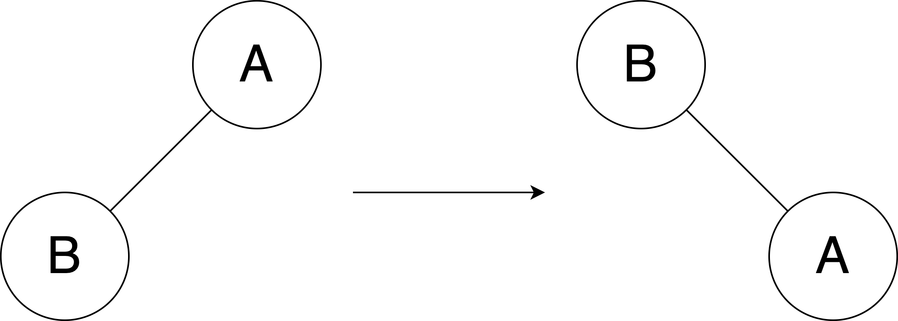
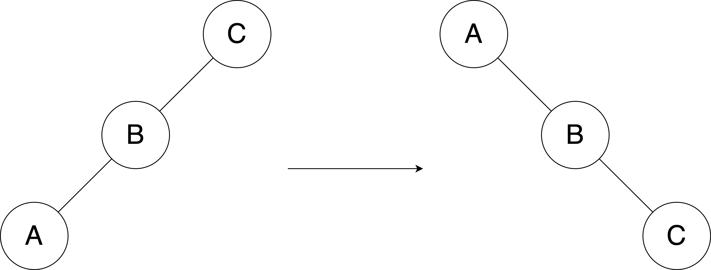
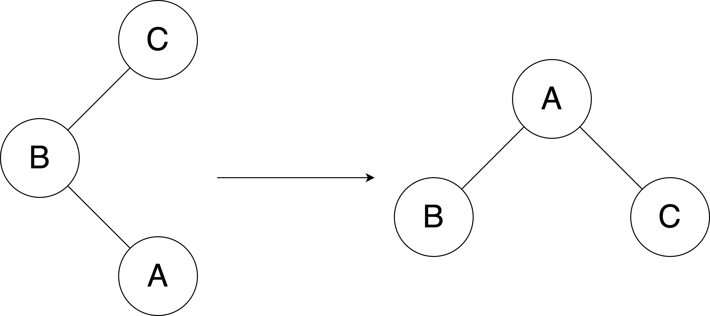
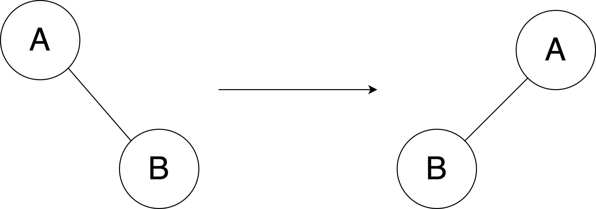
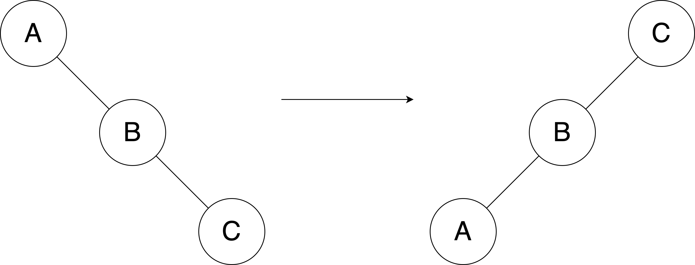
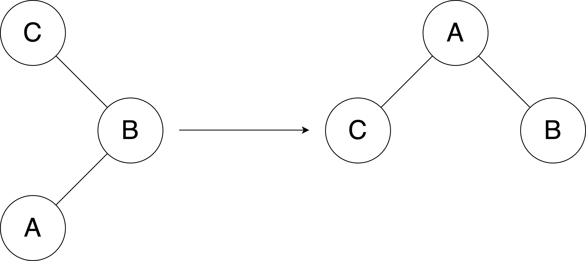
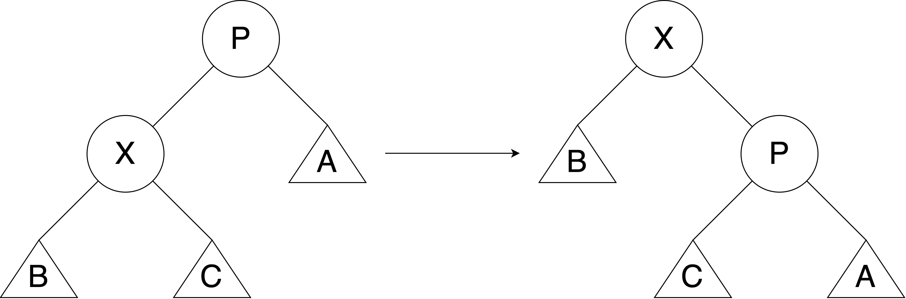
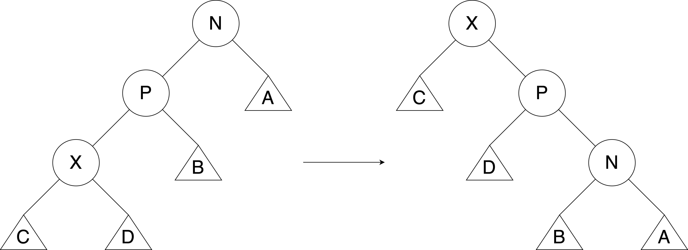
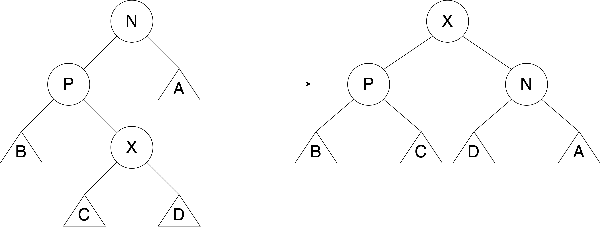

# Splay Tree

## Indice
- [Introduzione](#introduzione)
- [Procedura di Splay](#procedura-di-splay)
  - [Operazioni di rotazione nello Splay Tree](#operazioni-di-rotazione-nello-splay-tree)
- [Analisi ammortizzata](#analisi-ammortizzata)
  - [Costi di rotazione](#costi-di-rotazione)
  - [Teorema sul costo ammortizzato di splay](#teorema-sul-costo-ammortizzato-di-splay)
  - [Dimostrazione per casi](#dimostrazione-per-casi)
    - [Caso Zig](#caso-zig)
    - [Caso Zig-zig](#caso-zig-zig)
    - [Caso Zig-zag](#caso-zig-zag)
    - [Costo ammortizzato complessivo dello splay](#costo-ammortizzato-complessivo-dello-splay)

### Implementazione
- [Splay Tree]()
- [Istruzioni per la compilazione](#istruzioni-per-la-compilazione)

## Introduzione
Gli Splay Tree costituiscono una struttura dati di tipo albero binario di ricerca, ideata da Tarjan e Sleator nel 1985, che consente di eseguire le operazioni di:
- **Inserimento**
- **Cancellazione**
- **Ricerca**

## Procedura di Splay
La particolarità degli Splay Tree è la procedura di **splay**, che si basa sul concetto di _località temporale_.
Questa procedura assume che un nodo, una volta utilizzato, potrebbe essere riutilizzato a breve.
Per ottimizzare l’accesso futuro, la procedura di splay sposta il nodo oggetto dell’operazione recente verso la radice dell'albero.
Questo avvicinamento viene effettuato tramite una serie di rotazioni che preservano le proprietà dell'albero binario di ricerca.

### Operazioni di rotazione nello Splay Tree
La procedura di splay si basa su una serie di rotazioni per spostare il nodo selezionato (quello su cui si è appena effettuata un'operazione) verso la radice dell'albero.
Le principali operazioni di rotazione sono:

- Zig  
  

- Zig-Zig  
  

- Zig-Zag  
  

- Zag  
  

- Zag-Zag  
  

- Zag-Zig  
  

## Analisi ammortizzata
Negli Splay Tree, il costo ammortizzato di una rotazione è di $O(\log_2(n))$, dove $n$ è il numero di nodi.
Considerando $m$ operazioni di ricerca, inserimento o cancellazione, quello che si ottiene è una complessità ammortizzata totale di $O(m \cdot \log_2(n))$.

### Costi di rotazione
Ogni tipo di rotazione ha un costo definito come segue:

| Rotazione | Costo |
|----------|----------|
| Zig | 1 |
| Zig-zig | 2 |
| Zig-zag | 2 |

L'analisi ammortizzata calcola il costo medio di ogni operazione su una sequenza di operazioni, in questo caso viene sfruttando il **metodo del potenziale**.

Si definiscano le seguenti grandezze:

- $S(\nu)$: numeri di nodi del sotto albero radicato in $\nu$.
- $R(\nu)=_{DEF} \log_2(S(\nu))$: rango del nodo $\nu$.
- $\Phi(T)=\sum _{\nu \in T}R(\nu)$: funzione potenziale dell'albero $T$.

### Teorema sul costo ammortizzato di splay
> Il costo ammortizzato della procedura di splay è al più
>
> $$
> 3 \cdot (R(ROOT(T))-R(x))+1
> $$
>
> dove $x$ è il nodo in cui viene eseguita la splay.

### Dimostrazione per casi
#### Caso Zig

 

Si supponga che, dopo la rotazione, il numero di nodi nel sottoalbero radicato in $x$ sia aumentato, quindi $S_f(x) \geq S_i(x)$, e di conseguenza:

$$
R_f(x) \geq R_i(x)
$$

Calcolando la differenza nella funzione potenziale:

$$
\Delta \Phi(T)=R_f(x)-R_i(x) \leq 3 \cdot (R_f(x)-R_i(x))
$$

Pertanto, il costo ammortizzato della rotazione Zig è:

$$
\hat{c}_{zig} \leq 3 \cdot (R_f(x)-R_i(x))+1
$$

#### Caso Zig-zig

 

Nel caso Zig-zig, la differenza nella funzione potenziale risulta:

$$
\Delta \Phi(T)=R_f(x)+R_f(p)+R_f(n)-R_i(x)-R_i(p)-R_i(n)
$$

Poiché $S_i(n)=S_f(x) \rightarrow R_i(n)=R_f(x)$, segue:

$$
\Delta \Phi(T)=R_f(p)+R_f(n)-R_i(x)-R_i(p)
$$

Si può maggiorare $S_f(x) \geq S_f(p) \rightarrow R_f(x) \geq R_f(p)$ ottenendo:

$$
\Delta \Phi(T) \leq R_f(x)+R_f(n)-R_i(x)-R_i(p)
$$

$$
\Delta \Phi(T) \leq R_f(x)+R_f(n)-R_i(x)-R_i(p)+R_i(x)-R_i(x)
$$

Applicando il _lemma tecnico_ $S_i(x)+S_f(n) \leq S_f(x) \rightarrow R_i(x)+R_f(n) \leq 2 \cdot R_f(x)-2$ si ottiene:

$$
\Delta \Phi(T) \leq 2 \cdot R_f(x)-2+R_f(x)-2 \cdot R_i(x)-R_i(p)
$$

Si sottrae a $\Delta \Phi(T)$ la quantità $R_i(x)$ anziché $R_i(p)$, in questo modo la maggiorazione continua ancora a valere

$$
\Delta \Phi(T) \leq 3 \cdot R_f(x)-2-2 \cdot R_i(x)-R_i(x)
$$

$$
\Delta \Phi(T) \leq 3 \cdot R_f(x)-2-3 \cdot R_i(x)
$$

$$
\Delta \Phi(T) \leq 3 \cdot (R_f(x)-R_i(x))-2
$$

Quindi, il costo ammortizzato del caso Zig-zig è:

$$
\hat{c}_{zig-zig} \leq 3 \cdot (R_f(x)-R_i(x))
$$

#### Caso Zig-zag

 

Nel caso Zig-zag, la differenza nella funzione potenziale risulta:

$$
\Delta \Phi(T)=R_f(x)+R_f(p)+R_f(n)-R_i(x)-R_i(p)-R_i(n)
$$

Si osserva che, $S_i(n)=S_f(x) \rightarrow R_i(n)=R_f(x)$

Quindi:

$$
\Delta \Phi(T)=R_f(p)+R_f(n)-R_i(x)-R_i(p)
$$

Usando il _lemma tecnico_:

$$
\Delta \Phi(T) \leq 2 \cdot R_f(x)-2-R_i(x)-R_i(p)
$$

Si sottrae a $\Delta \Phi(T)$ la quantità $R_i(x)$ anziché $R_i(p)$, in questo modo la maggiorazione continua ancora a valere

$$
\Delta \Phi(T) \leq 2 \cdot R_f(x)-2-R_i(x)-R_i(x)
$$

$$
\Delta \Phi(T) \leq 2 \cdot R_f(x)-2-2\ R_i(x)
$$

$$
\Delta \Phi(T) \leq 2 \cdot (R_f(x)-R_i(x))-2
$$

Maggiorando per $3$ anziché $2$ vale ancora la maggiorazione:

$$
\Delta \Phi(T) \leq 3 \cdot (R_f(x)-R_i(x))-2
$$

Si può quindi definire il costo ammortizzato del caso Zig-zag come:

$$
\hat{c}_{zig-zag} \leq 3 \cdot (R_f(x)-R_i(x))
$$

#### Costo ammortizzato complessivo dello splay
Il costo ammortizzato complessivo della procedura di splay, considerando tutte le rotazioni possibili, è:

$$
\hat{c}_{splay} \leq \sum _{j=1}^{n} 3 \cdot (R _f^{(j)}(x)-R _i^{(j)}(x))+1
$$

Dove $j$ equivale alla $j \text{-} esima$ rotazione su $n$ rotazioni per portare il nodo $x$ fino alla radice.
Ciò quindi, equivale a scrivere:

$$
\hat{c}_{splay} \leq \sum _{j=1}^{n} 3 \cdot (R _f^{(j)}(x)-R _f^{(j-1)}(x))+1
$$

La sommatoria può essere svolta come _serie telescopica_, ottenendo:

$$
\hat{c}_{splay} \leq 3 \cdot (R _f^{(n)}(x)-R _f^{(1)}(x))+1
$$

Si indica con $R _f^{(n)}(x)$ il rango finale del nodo $x$ dopo aver completato tutte le rotazioni della procedura di splay.
In questo stato, il nodo $x$ è stato portato alla radice dell’albero.
D’altro canto, $R _f^{(1)}(x)$ rappresenta il rango di $x$ prima di iniziare la procedura di splay, ovvero la sua posizione originale nell'albero prima di ogni rotazione.

Quindi si può riscrivere la disugualianza come:

$$
\hat{c}_{splay} \leq 3 \cdot (R(ROOT(T))-R(x))+1
$$

Continuando con la maggiorazione, si ottiene:

$$
\hat{c}_{splay} \leq 3 \cdot (R(ROOT(T))-R(x))+1 \leq 3\ (R(ROOT(T)))+1
$$

Considerando che $R(ROOT(T)) \approx \log_2(n)$ si ottiene:

$$
\hat{c}_{splay} \leq 3 \cdot \log_2(n)+1
$$

Si conclude quindi che il costo ammortizzato della procedura di splay è:

$$
O(\log_2(n))
$$

e, considerando $m$ operazioni, la complessità ammortizzata complessiva è:

$$
O(m \cdot \log_2(n)) \quad \square
$$

---

## Istruzioni per la compilazione
Usare il comando `make`su questa directory, se la compilazione è andata a buon fine il programma può essere avviato tramite il comando `make run`.
